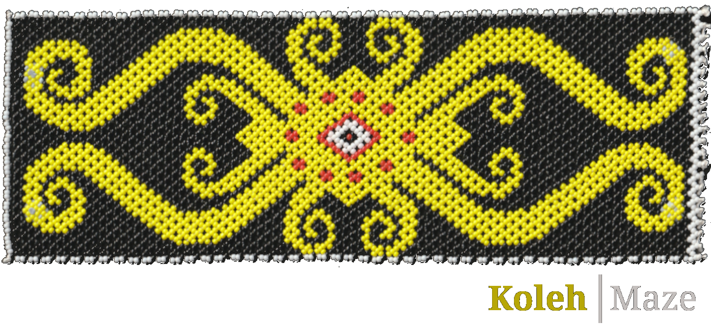
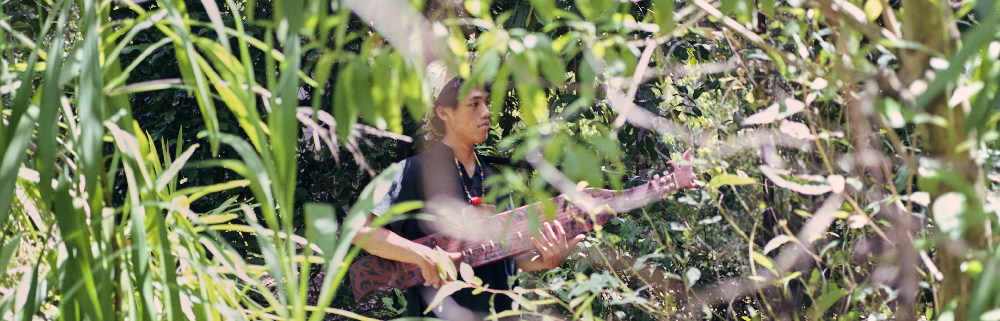

```{css, echo=FALSE}
h1 {color: green;}
svg {fill: grey;}
svg:hover {fill: green;}
audio::-webkit-media-controls-panel {
    background-color: #e5dc29;
}
audio {
    width: 100%;
}
```

```{r, echo=FALSE, message=FALSE}
library(icons)
library(embedr)
library("vembedr")
```

:::: {style="display: flex;"}
::: {}
[`r icon_style(fontawesome("youtube", style="brands"), scale=2)`](https://www.youtube.com/channel/UCBdQSepZY38qAxi3vdr5QYQ)

[`r icon_style(fontawesome("spotify", style="brands"),scale=2)`](https://open.spotify.com/artist/5dqd1bEKHSnfzHkf2V3v0J)

[`r icon_style(fontawesome("bandcamp", style="brands"),scale=2)`](https://koleh.bandcamp.com/)

[`r icon_style(fontawesome("apple", style="brands"),scale=2)`](https://music.apple.com/us/artist/koleh/1236599226)


:::
::: {style="padding-right: 20px;"}
\ 

:::

::: {}

`r embed_audio("audio/Maze.mp3", attribute="controls")`

```{r, echo=FALSE, fig.align='center', out.width='100%'}

```
:::

::::

## Bio

Koleh uses his music’s unique and refreshing blend of **South-east Asian instruments**,
samples and **contemporary Indie-pop** to transport listeners to Borneo rainforests
and village long-houses.

Embracing his heritage, the **Kenyah Dayaks of Borneo**, Koleh aims to carry on and
share his tradition by playing the **Sampe’**, which is a traditional Dayak lute / guitar like
instrument. This desire for cultural expression has a large influence on his music, as
well as other contemporary artists such as **D.D Dumbo, Bombay Bicycle Club and Beach House**.

The young artist is delighted to release '**Maze**'; the lush, rainforest-melancholy second single from his upcoming 'Songs From Upriver' EP. 

```{r img-with-knitr, echo=FALSE, fig.align='left', out.width='100%'}

```

## "It's easy to be charmed by this sweet gust of breezy indie pop.”- Dave Ruby Howe, Triple J

---

## Social Media

[`r icon_style(fontawesome("facebook", style="brands"), scale=2)` Facebook](https://www.facebook.com/KOLEH-1455565198056097)
`r icon_style(fontawesome("circle", style="solid"), scale=0.5)`
`r icon_style(fontawesome("circle", style="regular"), scale=0.5)`
`r icon_style(fontawesome("circle", style="solid"), scale=0.5)`
[`r icon_style(fontawesome("instagram", style="brands"),scale=2)` Instagram](https://www.instagram.com/ukolehle/)

### Contact

[`r icon_style(fontawesome("envelope", style="solid"), scale=1)` kolehmusic@gmail.com]()
